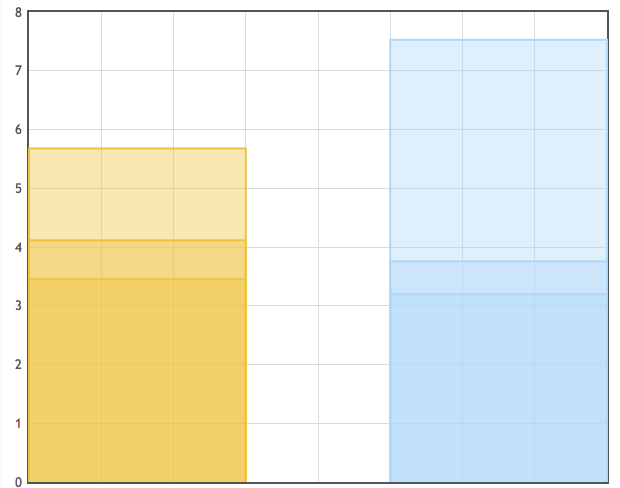
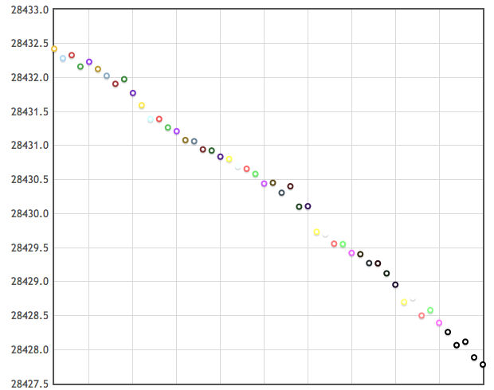

.. _example:

CeleryManagement Graphing Interface
###################################

CeleryManagement includes several utilities included in the web interface that
allow you to easily manage tasks and workers, as well as visualize data
associated with your tasks and workers through an included charting interface.

.. contents::

.. _charting:

Charting
========

.. _query_panel:

Query Panel
-----------
Presentation of information while using CeleryManagement is important. This is 
why a simple interface is included that allows you to query the system and 
quickly view the data that you requested.

.. figure:: media/query_panel.png
   :alt: query panel
   :align: center
   
   The CeleryManagement query panel

The query panel included with CeleryManagement allows you to filter, exclude, 
segment, and aggregate your data in multiple ways. The main portions of the 
panel are the segmentize and aggregate options.

.. _segmentation:

Segmentation
````````````
You can segment your data across the x-axis by various fields, including:

- Enumerated Data
    - Task name
    - State
    - Worker
- Time data
    - Run time
    - Wait time
    - Total time
    - Sent time
    - Received time
    - Start time
    - Success time
    - Failed time

Each field also has associated methods. Some methods do not apply to certain 
fields, but there are four total fields:

- Each
- Range
- Value
- All

The 'range' and 'each' fields correspond with time data while the 'each', 'value', 
and 'all' fields correspond with enumerated data.

.. _aggregation:

Aggregation
```````````
Aggregation is similar to segmentation in that it also has methods and 
corresponding fields to choose from. You aggregate your data across the y-axis
by various fields, including:

- Count
- Task name
- State
- Worker
- Run time
- Wait time
- Total time

Each field also has its associated methods and some methods do not apply 
to certain fields, as it is with Segmentation_. The fields include:

- Count
- Enumerate
- Average
- Min
- Max
- Sum
- Variance

'Count' corresponds to the 'count' method. 'Enumerate' corresponds to enumerated 
data: 'task name', 'state', and 'worker.' Time data, being discrete, allows the 
fields: 'average', 'min', 'max', 'sum', and 'variance.'

An important distinction when choosing aggregate methods is that a particular 
field can have multiple methods associated with it at one time.

.. _examples:

Examples
--------
You can expect very different output from different queries that are sent to the 
server. All data that is returned depends on the tasks that have been run, the 
amount of workers you have executing said tasks, as well as other information.

Below you can see a char of the average, min, and max run times of tasks that were 
executed on a particular worker. The associated query sent to the server was::

    Segmentize
        Field: Worker
        Method: All
    Aggregate
        Field: Runtime
        Methods: Average, Min, Max

.. figure:: media/chart_runtime_avgminmax_line.png
   :width: 500px
   :alt: average, min, and max worker runtime line
   :align: center

   The average, minimum, and maximum runtime for a single worker
   presented in line graph form

What if you have multiple workers executing tasks? When another worked was
activated, the same task was run, and the same query used before was submitted, 
the data returned what charted below.



   The average, minimum, and maximum runtime for workers presented in
   a bar graph form

In this chart, the option was set to display data as bar graphs. You can still see 
the average, min, and max run times of tasks executed on each worker.

Besides working with workers, you can retrieve data related to tasks. For example, 
running the following query yields a chart of the number of tasks::
  
   Segmentize
       Field: Task Name
       Method: All
   Aggregate
       Field: Count
       Methods: Count


   The number of tasks that were executed by all workers

The chart shows that you that 50 ErlangBPolicySimTask were run on the several 
different workers.

When visualizing large amounts of data, sometimes you have to decided which type of
graphs (line or chart) that you wish to use. The chart below shows the total time
taken for each task to execute on a given worker. It was generated using::

    Segmentize
       Field: Task Name
       Method: Each
    Aggregate
       Field: Total Time
       Methods: Average

.. figure:: media/chart_taskname_totaltime_bar.png
   :width: 500px
   :alt: taskname totaltime bar
   :align: center

   The total time of each task that was executed presented in bar graph
   form

As you can see, it seems like there isnt much variation in the data. That is because 
we are using a bar graph to display time values that are very close. When you switch
to a line graph, like below, you can see the variation more clearly.



   The total time of each task that was executed presented in line graph
   form

With any data that is charted, you can choose to display through a bar or line graph. 
It is up to you to decide which form would be the best for your data. Sometimes, all
you need is a bar graph and sometimes, like in the previous case, a line graph will 
show you the small variations in your data. The choice is left up to you.
